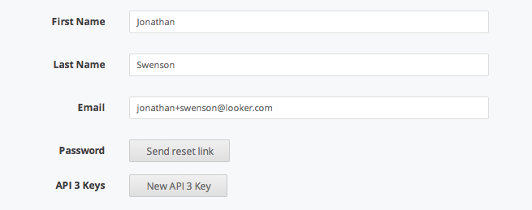
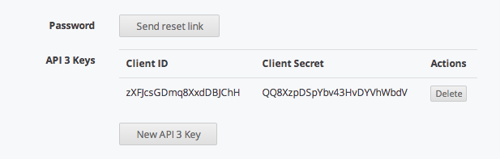

# [Looker](http://looker.com/) SDK for Ruby

### Installation
Get the repository:

```bash
$ git clone git@github.com:looker/looker-sdk-ruby.git looker-sdk
$ cd looker-sdk
$ bundle install
$ rake install
```

### Development

```bash
$ bundle install
$ rake test # run the test suite
$ rake test:all # run the test suite on all supported Rubies
```

### TODO
Things that we think are important to do will be marked with `look TODO`.

### Finding API credentials

1. Within the Looker Application go to the /admin/users page (must be an administrator).
2. Find your user and click edit.
3. Under the heading API 3 Keys click "New API 3 Key".
    
4. Administrators can add keys and delete keys from this panel.
    

### Basic Usage

```ruby
require 'looker-sdk'

# Log in using API 3.0 client_id and client_secret
client = LookerSDK::Client.new(
  :connection_options => {:ssl => {:verify => false}},
  :client_id => "<client-id>",
  :client_secret => "<client-secret>"
)

# if you don't want to provide credentials: (trust me you don't)
# add the following to your ~/.netrc file (or create the file if you don't have one):
# machine localhost
#   login <client_id>
#   password <client_secret>
client = LookerSDK::Client.new(
  :connection_option => {:ssl => {:verify => false}},
  :netrc      => true,
)

# Supports user creation, read, modification, deletion
# Supports credentials_user creation, read, modification, and deletion.

# Create users (and their associated credentials_email)
first_user = client.create_user({:first_name => "Jonathan", :last_name => "Swenson"})
client.create_credentials_email(first_user[:id], "jonathan@looker.com")

second_user = client.create_user({:first_name => "John F", :last_name => "Kennedy"})
client.create_credentials_email(first_user[:id], "john@looker.com")

third_user = client.create_user({:first_name => "Frank", :last_name => "Sinatra"})
client.create_credentials_email(first_user[:id], "frank@looker.com")

# Get current logged in user
user = client.user

# properties can be accessed as methods or hashes
user.first_name  # "Jonathan"
user[:last_name] # "Swenson"

# Get user by id
user = client.user(first_user[:id])
user.first_name # "Jonathan"
user.last_name  # "Swenson"

# update a user
client.update_user(first_user[:id], {:first_name => "Jonny"}
user = client.user(first_user[:id])
user.first_name # "Jonny"

# Get credentials email for user
credentials_email = client.get_credentials_email(user[:id])
credentials_email[:email] # jonathan@looker.com

# Update user's credentials Email
client.update_credentials_email(user[:id], {:email => "jonathan+1@looker.com"})
credentials_email = client.get_credentials_email(user[:id])
credentials_email[:email] # jonathan+1@looker.com

# Get all Users
users = client.all_users()
users.length # 3
users[0]     # first_user

# Deleting Users and Credentials Email
client.delete_credentials_email(second_user[:id])
LookerSDK.delete_user(second_user[:id])

users = client.all_users()
users.length # 2
users[1]     # third_user

# CRUD for roles, role_types, and role_domains
```

### Adding to the SDK:

We have subscribed to the WWGD mentality - What Would Github Do? The LookerSDK is roughly based upon [Octokit](https://github.com/octokit/octokit.rb) Github's ruby SDK for github's [API](https://developer.github.com/v3). 

Adding to the SDK should be relatively straightforward. The modules within client correspond to Looker resources (Role, Users, Looks, etc.) Each of these modules implements a set of methods that correspond to simple CRUD actions and their associated [HTTP verbs](https://developer.github.com/v3/#http-verbs).

####For example: 
Actions on a Resource (users)

```ruby
get_users()             # get "/api/3.0/users"
user(id)                # get "/api/3.0/users/:id"
create_user(options)    # post "/api/3.0/users" options
update_user(id, option) # patch "/api/3.0/users/:id" options
delete_user(id)         # delete "/api/3.0/users/:id"
```

Associations between Resources (users and roles)

```ruby
# get all of a user's roles
user_roles(id)            # get "/api/3.0/users/:id/roles"
# set the roles of a user (roles is an array of role ids)
set_user_roles(id, roles) # put "/api/3.0/users/:id/roles" {:roles => roles}
```

More Associations between Resources (dashboards and looks)

```ruby 
# get all looks for a dashboard
dashboard_looks(dash_id)             # get "/api/3.0/dashboards/:id/looks"
# add a look to a dashboard
add_dashboard_look(dash_id, look_id) # put "/api/3.0/dashboards/:id/looks" {:look_id => look_id}
```